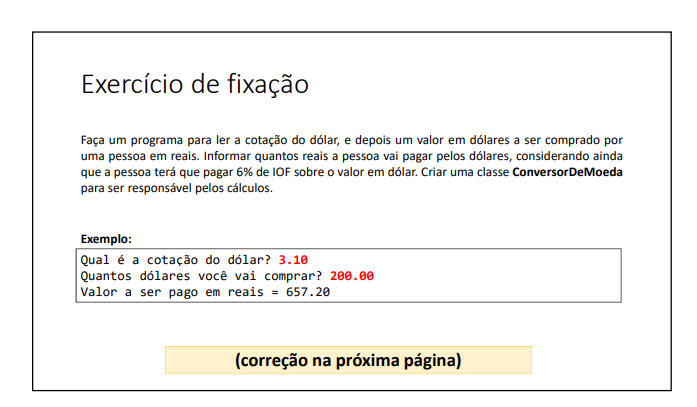

# Mini projetinho

Este repositório contém um pequeno projeto destinado a praticar lógica de programação com orientação a objetos. Abaixo, você encontrará o enunciado, exemplos e o código de resolução desenvolvido por mim.

## Enunciado

